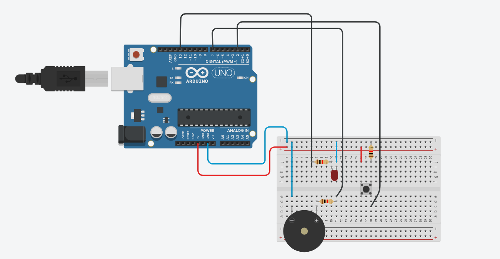

## Reaction Time Tester
A simple reaction time testing app built with Python and arduino, with a visual interface using tkinter and matplotlib.

### Setup

#### Arduino
Integral part of this project is an arduino. Aside from an arduino you will need:

- button
- led
- buzzer
- breadboard
- cables
- 3 resistors (for led, buzzer, and a pull-down for the button)

I organised my breadboard this way:  



#### The app

```
1) git clone https://github.com/Illuamon/reaction_time_tester
2) cd reaction_time_tester
3) python -m venv venv
4) venv\Scripts\activate
5) pip install -r requirements.txt
```
### Run
Flash main.cpp into your arduino and then run python_main.py.

You might also want to look at settings.py and set the correct port for the arduino.